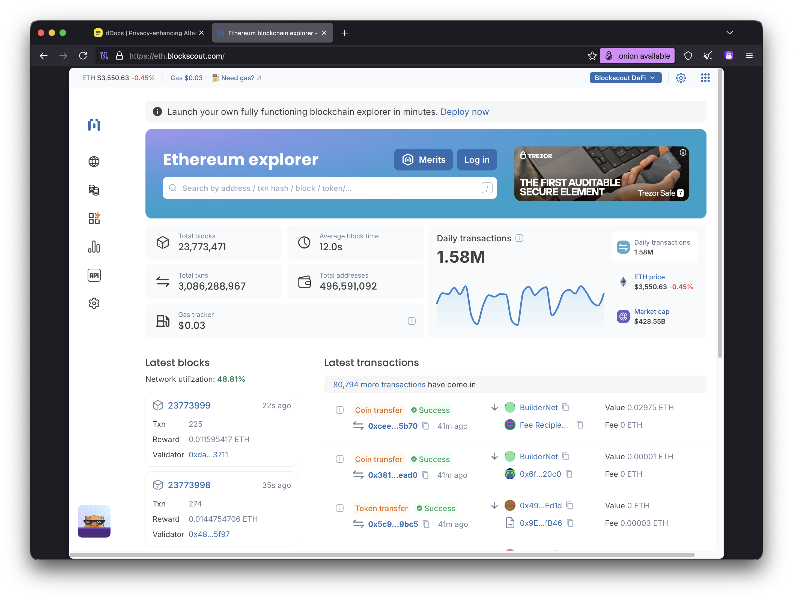

# Onion-Location HTTP Header Guide

## Table of Contents
- [What is Onion-Location?](#what-is-onion-location)
- [How It Works](#how-it-works)
- [Browser Behavior](#browser-behavior)
- [Implementation Guide](#implementation-guide)
  - [Nginx](#nginx)
  - [Apache](#apache)
  - [Other Web Servers](#other-web-servers)
- [Security Considerations](#security-considerations)
- [Testing](#testing)
- [Examples](#examples)
- [FAQ](#faq)

## What is Onion-Location?

The `Onion-Location` HTTP header is a standardized way for websites to advertise their Tor onion service address to users browsing through Tor Browser. When implemented, Tor Browser displays a purple onion icon in the address bar, allowing users to easily switch from the clearnet version to the more private .onion version of the site.

### Benefits

1. **Enhanced Privacy**: .onion services provide end-to-end encryption within the Tor network
2. **Location Privacy**: No exit node can see traffic to your .onion service
3. **Better Performance**: Direct connection through Tor without exit nodes
4. **Censorship Resistance**: .onion addresses are harder to block than clearnet domains
5. **Improved User Trust**: Shows commitment to privacy and security

### Real-World Examples

- **Blockscout**: https://eth.blockscout.com (view in Tor Browser to see the feature)
- **The New York Times**: https://www.nytimes.com
- **ProtonMail**: https://protonmail.com
- **DuckDuckGo**: https://duckduckgo.com

## How It Works

### Technical Flow

1. User visits your clearnet site (e.g., `https://example.com`) using Tor Browser
2. Your web server includes the `Onion-Location` header in the HTTP response:
   ```
   Onion-Location: http://your-onion-address.onion/path
   ```
3. Tor Browser detects the header and displays a purple onion icon in the address bar
4. User clicks the onion icon to switch to the .onion version
5. Tor Browser navigates to the .onion address, preserving the path and query parameters

### Header Format

```
Onion-Location: <onion-url>
```

**Components:**
- Protocol: Usually `http://` (HTTPS requires valid certificate for .onion)
- Onion address: Your v3 onion address (56 characters + `.onion`)
- Path: Should include `$request_uri` or equivalent to preserve navigation context

**Example:**
```
Onion-Location: http://thehiddenwiki7oyvfj3r2mjbgqfbwfb5kpjfxqtbxhwvlj2xjgpqohtcyd.onion/about
```

## Browser Behavior

### Tor Browser

- **Detection**: Automatically detects `Onion-Location` header
- **UI Indicator**: Purple onion icon appears in address bar
- **User Action**: Click icon to switch to .onion version
- **Privacy**: No automatic redirect to protect user choice
- **Path Preservation**: Full URL path and query parameters are preserved

### Other Browsers

- **Standard browsers** (Chrome, Firefox, Safari, etc.) ignore the header
- **No negative impact** on non-Tor users
- **Progressive enhancement** approach - works when Tor is available

### User Preferences

Tor Browser respects user preferences:
- Users can disable automatic .onion detection
- First-time users see an educational prompt
- Settings available in `about:preferences#privacy`

### Visual Example

When properly configured, Tor Browser displays a purple onion icon in the address bar when detecting the `Onion-Location` header:



*Example from [Blockscout](https://eth.blockscout.com) showing the purple onion icon that appears when the Onion-Location header is detected in Tor Browser. Clicking this icon switches the user to the .onion version of the site.*

## Implementation Guide

### Nginx

#### Basic Configuration

```nginx
server {
    listen 443 ssl http2;
    server_name example.com;

    ssl_certificate /path/to/ssl/cert.pem;
    ssl_certificate_key /path/to/ssl/key.pem;

    # Add Onion-Location header
    add_header Onion-Location "http://your-onion-address.onion$request_uri" always;

    location / {
        root /var/www/html;
        index index.html;
    }
}
```

#### Using Variables

```nginx
server {
    listen 443 ssl http2;
    server_name example.com;

    # Define onion address as variable for easy maintenance
    set $onion_address "your-onion-address.onion";

    add_header Onion-Location "http://$onion_address$request_uri" always;

    location / {
        root /var/www/html;
    }
}
```

#### For Proxied Applications

```nginx
server {
    listen 443 ssl http2;
    server_name example.com;

    location / {
        proxy_pass http://localhost:3000;
        proxy_set_header Host $host;

        # Add header for proxied responses
        add_header Onion-Location "http://your-onion-address.onion$request_uri" always;
    }
}
```

**Complete example**: See [nginx-onion-location.conf](./nginx-onion-location.conf)

### Apache

#### Basic Configuration (.htaccess)

```apache
<IfModule mod_headers.c>
    Header set Onion-Location "http://your-onion-address.onion%{REQUEST_URI}e" env=!NO_ONION
</IfModule>
```

#### Virtual Host Configuration

```apache
<VirtualHost *:443>
    ServerName example.com

    SSLEngine on
    SSLCertificateFile /path/to/cert.pem
    SSLCertificateKeyFile /path/to/key.pem

    # Add Onion-Location header
    Header set Onion-Location "http://your-onion-address.onion%{REQUEST_URI}e"

    DocumentRoot /var/www/html
</VirtualHost>
```

#### Conditional Header (Only for Tor Users)

```apache
<VirtualHost *:443>
    ServerName example.com

    # Set variable if request comes from Tor
    SetEnvIf X-Forwarded-For "tor-pattern" is_tor=1

    # Add header only for Tor users
    Header set Onion-Location "http://your-onion-address.onion%{REQUEST_URI}e" env=is_tor

    DocumentRoot /var/www/html
</VirtualHost>
```

### Other Web Servers

#### Caddy

```caddy
example.com {
    header Onion-Location "http://your-onion-address.onion{uri}"

    root * /var/www/html
    file_server
}
```

#### Node.js (Express)

```javascript
const express = require('express');
const app = express();

const ONION_ADDRESS = 'your-onion-address.onion';

app.use((req, res, next) => {
    res.setHeader('Onion-Location', `http://${ONION_ADDRESS}${req.originalUrl}`);
    next();
});

app.listen(3000);
```

#### Python (Flask)

```python
from flask import Flask, request

app = Flask(__name__)
ONION_ADDRESS = 'your-onion-address.onion'

@app.after_request
def add_onion_location(response):
    onion_url = f"http://{ONION_ADDRESS}{request.full_path.rstrip('?')}"
    response.headers['Onion-Location'] = onion_url
    return response

if __name__ == '__main__':
    app.run()
```

#### Go

```go
package main

import (
    "net/http"
)

const onionAddress = "your-onion-address.onion"

func onionLocationMiddleware(next http.Handler) http.Handler {
    return http.HandlerFunc(func(w http.ResponseWriter, r *http.Request) {
        onionURL := "http://" + onionAddress + r.RequestURI
        w.Header().Set("Onion-Location", onionURL)
        next.ServeHTTP(w, r)
    })
}

func main() {
    mux := http.NewServeMux()
    mux.HandleFunc("/", handler)

    http.ListenAndServe(":8080", onionLocationMiddleware(mux))
}
```

## Security Considerations

### 1. Verify Your Onion Service

**Before advertising:**
- Ensure your .onion service is fully functional
- Test all major features on the .onion version
- Verify certificates if using HTTPS
- Check that all resources load correctly (CSS, JS, images)

### 2. Use HTTPS on Clearnet

```nginx
# Redirect HTTP to HTTPS first
server {
    listen 80;
    server_name example.com;
    return 301 https://$server_name$request_uri;
}

# Then add Onion-Location on HTTPS
server {
    listen 443 ssl http2;
    server_name example.com;
    add_header Onion-Location "http://your-onion-address.onion$request_uri" always;
}
```

### 3. HTTP vs HTTPS for Onion

**Most common: HTTP**
```
Onion-Location: http://your-onion-address.onion/path
```

**HTTPS (requires valid certificate):**
```
Onion-Location: https://your-onion-address.onion/path
```

**Important:**
- .onion services don't need HTTPS for encryption (Tor provides this)
- HTTPS on .onion requires a valid certificate authority
- Most .onion services use HTTP

### 4. Always Include "always" Flag (Nginx)

```nginx
# CORRECT - Header added even on error pages
add_header Onion-Location "http://your-onion.onion$request_uri" always;

# WRONG - Header missing on error responses
add_header Onion-Location "http://your-onion.onion$request_uri";
```

### 5. Preserve Request URI

```nginx
# CORRECT - Preserves full path and query params
add_header Onion-Location "http://your-onion.onion$request_uri" always;

# WRONG - Loses path information
add_header Onion-Location "http://your-onion.onion" always;
```

### 6. Content Security Policy

Ensure your CSP allows resources from your .onion domain:

```nginx
add_header Content-Security-Policy "default-src 'self' your-onion-address.onion";
```

### 7. Monitor Both Services

- Set up monitoring for both clearnet and .onion versions
- Use this project's monitoring system to track .onion availability
- Alert on discrepancies between clearnet and .onion uptime

### 8. Privacy Considerations

**Do NOT:**
- Automatically redirect Tor users to .onion (violates user choice)
- Track which users click the onion button
- Differentiate content between clearnet and .onion

**Do:**
- Let users choose when to switch
- Provide identical content on both versions
- Document your .onion address publicly

## Testing

### 1. Configuration Syntax Validation

#### Nginx
```bash
# Test nginx configuration
sudo nginx -t

# Reload if valid
sudo nginx -s reload
```

#### Apache
```bash
# Test Apache configuration
sudo apachectl configtest

# Reload if valid
sudo systemctl reload apache2
```

### 2. Manual Header Testing

#### Using curl

```bash
# Test from command line
curl -I https://example.com | grep -i onion-location

# Expected output:
# Onion-Location: http://your-onion-address.onion/
```

#### Using curl with specific path

```bash
# Test with path preservation
curl -I https://example.com/about | grep -i onion-location

# Expected output:
# Onion-Location: http://your-onion-address.onion/about
```

#### Using curl with query parameters

```bash
# Test with query parameters
curl -I "https://example.com/search?q=test" | grep -i onion-location

# Expected output:
# Onion-Location: http://your-onion-address.onion/search?q=test
```

### 3. Browser Testing

#### With Tor Browser

1. Open Tor Browser
2. Navigate to your clearnet site: `https://example.com`
3. Look for purple onion icon in address bar (right side)
4. Click the icon - should show option to switch
5. Click "Switch" - should navigate to .onion version
6. Verify URL changed to .onion address
7. Test multiple pages to ensure path preservation

#### Screenshots

Store reference screenshots in `/docs/images/`:
- `onion-location-indicator.png` - Purple onion icon in address bar
- `onion-location-prompt.png` - Switch confirmation dialog
- `onion-location-active.png` - Successfully loaded .onion site

### 4. Automated Testing Script

```bash
#!/bin/bash
# test-onion-location.sh

DOMAIN="https://example.com"
EXPECTED_ONION="your-onion-address.onion"

echo "Testing Onion-Location header..."

# Test root path
HEADER=$(curl -s -I "$DOMAIN" | grep -i "onion-location")
if [[ $HEADER == *"$EXPECTED_ONION"* ]]; then
    echo "✓ Root path: Header present"
else
    echo "✗ Root path: Header missing or incorrect"
    exit 1
fi

# Test with path
HEADER=$(curl -s -I "$DOMAIN/about" | grep -i "onion-location")
if [[ $HEADER == *"$EXPECTED_ONION/about"* ]]; then
    echo "✓ Path preservation: Working"
else
    echo "✗ Path preservation: Failed"
    exit 1
fi

# Test with query parameters
HEADER=$(curl -s -I "$DOMAIN/search?q=test" | grep -i "onion-location")
if [[ $HEADER == *"$EXPECTED_ONION/search?q=test"* ]]; then
    echo "✓ Query parameters: Working"
else
    echo "✗ Query parameters: Failed"
    exit 1
fi

echo "All tests passed!"
```

### 5. Continuous Monitoring

Add to your monitoring system (like this onion-monitoring project):

```json
{
  "title": "Example Clearnet Site",
  "name": "example-clearnet",
  "url": "https://example.com",
  "check_onion_location": true,
  "expected_onion": "your-onion-address.onion"
}
```

## Examples

### Example 1: Static Website

```nginx
server {
    listen 443 ssl http2;
    server_name staticsite.com;

    ssl_certificate /etc/ssl/certs/staticsite.crt;
    ssl_certificate_key /etc/ssl/private/staticsite.key;

    add_header Onion-Location "http://staticsite7abcd1234.onion$request_uri" always;

    root /var/www/staticsite;
    index index.html;
}
```

### Example 2: WordPress

```nginx
server {
    listen 443 ssl http2;
    server_name blog.example.com;

    add_header Onion-Location "http://blogonion1234567.onion$request_uri" always;

    root /var/www/wordpress;

    location / {
        try_files $uri $uri/ /index.php?$args;
    }

    location ~ \.php$ {
        fastcgi_pass unix:/var/run/php/php8.1-fpm.sock;
        fastcgi_param SCRIPT_FILENAME $document_root$fastcgi_script_name;
        include fastcgi_params;
    }
}
```

### Example 3: Node.js Application

```nginx
server {
    listen 443 ssl http2;
    server_name app.example.com;

    add_header Onion-Location "http://apponion123456789.onion$request_uri" always;

    location / {
        proxy_pass http://localhost:3000;
        proxy_http_version 1.1;
        proxy_set_header Upgrade $http_upgrade;
        proxy_set_header Connection 'upgrade';
        proxy_set_header Host $host;
        proxy_cache_bypass $http_upgrade;
    }
}
```

### Example 4: API Server

```nginx
server {
    listen 443 ssl http2;
    server_name api.example.com;

    # Add CORS headers along with Onion-Location
    add_header Onion-Location "http://apionion987654321.onion$request_uri" always;
    add_header Access-Control-Allow-Origin "*" always;

    location /v1/ {
        proxy_pass http://localhost:8080;
        proxy_set_header Host $host;
        proxy_set_header X-Real-IP $remote_addr;
    }
}
```

### Example 5: Multi-Domain Setup

```nginx
# Main site
server {
    listen 443 ssl http2;
    server_name example.com;
    add_header Onion-Location "http://example123456789.onion$request_uri" always;
    root /var/www/main;
}

# Blog subdomain
server {
    listen 443 ssl http2;
    server_name blog.example.com;
    add_header Onion-Location "http://blog123456789.onion$request_uri" always;
    root /var/www/blog;
}

# API subdomain
server {
    listen 443 ssl http2;
    server_name api.example.com;
    add_header Onion-Location "http://api123456789.onion$request_uri" always;
    location / {
        proxy_pass http://localhost:8080;
    }
}
```

## FAQ

### Q: Should I use HTTP or HTTPS for the .onion address?

**A:** Use HTTP unless you have a specific reason for HTTPS. Tor already provides end-to-end encryption, so HTTPS on .onion is usually unnecessary. HTTPS requires obtaining a valid certificate for your .onion address, which adds complexity.

### Q: Will this affect non-Tor users?

**A:** No. Regular browsers ignore the `Onion-Location` header. Only Tor Browser recognizes and acts on it. There's no negative impact on normal users.

### Q: Should I automatically redirect Tor users to my .onion site?

**A:** No. Automatic redirection violates user choice and privacy principles. The Tor Project recommends using the `Onion-Location` header, which lets users decide when to switch.

### Q: Can I use this with subdomains?

**A:** Yes. Each subdomain can advertise its own .onion address. See Example 5 in the Examples section.

### Q: How do I get a .onion address?

**A:** You need to set up a Tor hidden service. See the [Tor Project documentation](https://community.torproject.org/onion-services/) for instructions. This monitoring project uses Arti for Tor connectivity.

### Q: What if my .onion service goes down?

**A:** Remove or comment out the `Onion-Location` header until the service is back online. Advertising an offline .onion service creates a poor user experience.

### Q: Can I advertise multiple .onion addresses?

**A:** No. The header only supports one .onion address per response. If you have multiple services, use subdomain-specific .onion addresses.

### Q: Does the header work with wildcards?

**A:** No. You must specify the complete .onion address. You can use nginx/Apache variables to make maintenance easier.

### Q: How do I monitor my .onion service?

**A:** Use this onion-monitoring project! Add your .onion address to `onions.json` and the system will automatically monitor availability and response times.

### Q: Should I include the header on API responses?

**A:** Yes, if you have an .onion version of your API. API clients using Tor can benefit from connecting directly to the .onion service.

### Q: What about mobile Tor Browser?

**A:** Mobile Tor Browser (Android) supports `Onion-Location` the same way as desktop. iOS doesn't have an official Tor Browser, but Onion Browser for iOS may support it.

### Q: Can I test without Tor Browser?

**A:** You can verify the header exists using `curl`, but you need Tor Browser to see the actual UI indicator and test the switching functionality.

## Additional Resources

- [Tor Project - Onion-Location Specification](https://community.torproject.org/onion-services/advanced/onion-location/)
- [Tor Browser Manual](https://tb-manual.torproject.org/)
- [Setting Up Onion Services](https://community.torproject.org/onion-services/setup/)
- [Example: Blockscout Implementation](https://eth.blockscout.com) - View in Tor Browser
- [This Project's Monitoring System](../README.md)

## Contributing

Found an issue or have a suggestion? Please open an issue or submit a pull request to this repository.

## License

This documentation is part of the onion-monitoring project and is dual-licensed under MIT and Apache 2.0.

---

**Last Updated:** 2025-01-11
**Maintained by:** Onion Service Monitor Project
